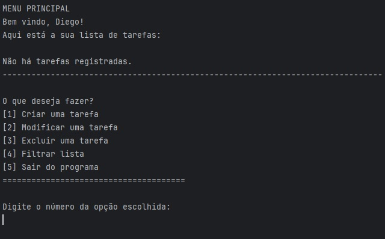

# Gerenciador de Tarefas

## Introdução
Para o projeto final da disciplina: “Linguagem de Programação I”, optamos por realizar um
aplicativo de gerenciamento de tarefas para organização pessoal, que pode ser utilizado para
gerenciar tarefas relacionadas com estudo, trabalho e outras atividades pessoais; optamos por esta
ideia dentre as sete apresentadas pelo professor, visando relacionar este projeto com o nosso projeto
de Banco de Dados — que tratava-se de uma escola de música, assim, os alunos da mesma
poderiam utilizar este aplicativo para gerenciar: tarefas, lições de casa, sessões de estudo, gerenciar
aulas práticas e a aulas teóricas, dentre outros.

## Objetivos
### Objetivo Geral
Este trabalho tem como objetivo geral o desenvolvimento de um sistema simples para organização
pessoal, permitindo que usuários cadastrem, acompanhem e concluam suas tarefas do dia a dia. Este
aplicativo visa auxiliar no planejamento e na produtividade.

### Objetivo específicos
- Permitir o cadastro de tarefas com título, descrição, data e status;
- Permitir que o usuário visualize todas as tarefas registradas;
- Permitir a marcação de tarefas como concluídas;
- Permitir a edição e exclusão de tarefas;
- Permitir a filtragem de tarefas por status (pendente ou concluída) ou por data.

## Linguagens
- Java.

## Tecnologias
- Git e GitHub.

## Melhorias futuras
Algumas melhorias que poderiam ser realizadas no aplicativo, sugerimos as seguintes:
- Notificações ou alertas para tarefas próximas do vencimento;
- Classificação por prioridade;
- Interface gráfica para uso mais intuitivo;
- Exportação de tarefas para um arquivo;
- A lista de tarefas ser relacionada ao usuário;
- Permitir ao usuário a escolha de: cancelar a criação ou edição de uma tarefa;
- Permitir que o usuario filtre tarefas por mês ou ano;
- Implementar tarefas que se repetem diariamente, semanalmente ou mensalmente (Exemplo:
  Pagar a conta de luz, todo mês);
- Gerar um resumo automático das tarefas do dia ou da semana, mostrando pendências, tarefas
  concluídas e próximas do vencimento.

## Conclusão
Para o desenvolvimento deste projeto, visamos utilizar alguns dos conceitos aprendidos ao longo da
disciplina de “Linguagem de Programação I” como: o uso de construtores, estruturas de controle de
fluxo, laços de repetição, arrays e estruturas de dados e cada uma dessas ferramentas foi de extrema
importância para o desenvolvimento do nosso aplicativo de gerenciamento de tarefas, acarretando
em um sistema funcional que atende às necessidades básicas de organização pessoal. Assim,
utilizando este aplicativo, qualquer pessoa pode gerenciar melhor as suas tarefas e organizar o seu
dia-a-dia com mais eficiência.